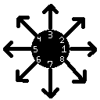
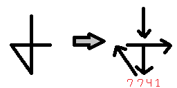

# Sigil
A flash gesture recognition algorithm that can be used in a variety of applications.

## Description
This algorithm can be used to recognize very simple gestures defined by rough directional movements created by calculating the general direction the user moves their mouse and encoding those movements as digits.

## Break-down
First, we take the user's drawing as a set of points. These points make up the rough shape that the user drew.

The algorithm then iterates over pairs of these points, finding the angle between the two points using **atan2**. Then, it finds the closest of 8 simple directions that matches this.

By simplifying the gesture into these 8 basic directions, we can encode the gesture into a string of digits 1 - 8.

This allows the algorithm to match it to the closest defined shape by iterating over the known shapes and using the **Levenshtein Distance Algorithm** to find the closest match. It will then output what it thinks the user drew.

## Weaknesses
Obviously this algorithm is far from perfect. It doesn't take variations of the shapes or the user's unique way of drawing that shape into account, and instead accepts mostly canonical drawings. This algorithm should not be used to define complex gestures, and instead should be limited to simple swipe gestures or shapes that can be defined as only a few simple directions.

## Strengths
That said, this algorithm is pretty fast and it is easy to define new gestures. If you don't want to write a complex algorithm just to match simple gestures, this is a really good way of doing that.

## Modifying the Algorithm
You can modify the algorithm to try to get more accurate results. The constant **POINT_DIST** is used to define the distance between each point making up the user's drawing. As the user moves their mouse, when the algorithm detects that the distance from the last point in the gesture is greater than or equal to this distance, it creates a new point, and so on until the user releases the mouse. Having a small distance results in a much smoother drawing, but the defined gestures aren't very long strings, so there can easily be confusion when comparing a long gesture made of many points to a short, roughly defined shape.

To add a new gesture, simply add a string to the SIGILS list containing a string of digits 1 - 8 that correspond to the directions the user must move their mouse in order to draw the "sigil". Also add this string to the SIGIL_MAP, along with a value corresponding to the "name" of your sigil. This is what will print to the console when it identifies the gesture.

The Levenshtein algorithm uses numpy to create a matrix just so it's easier to read and manipulate, but you could easily accomplish this with plain old lists.
